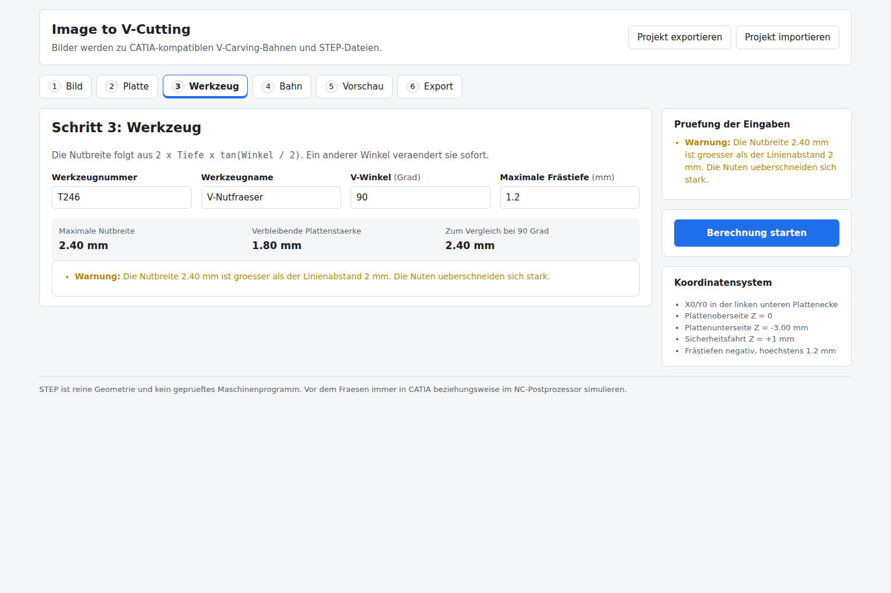
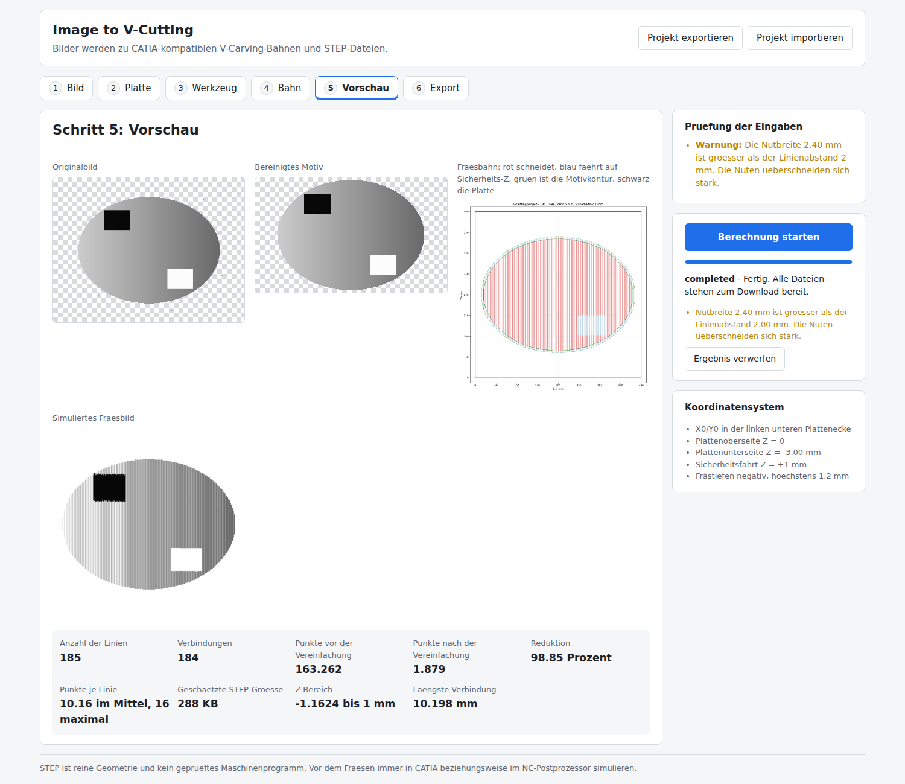
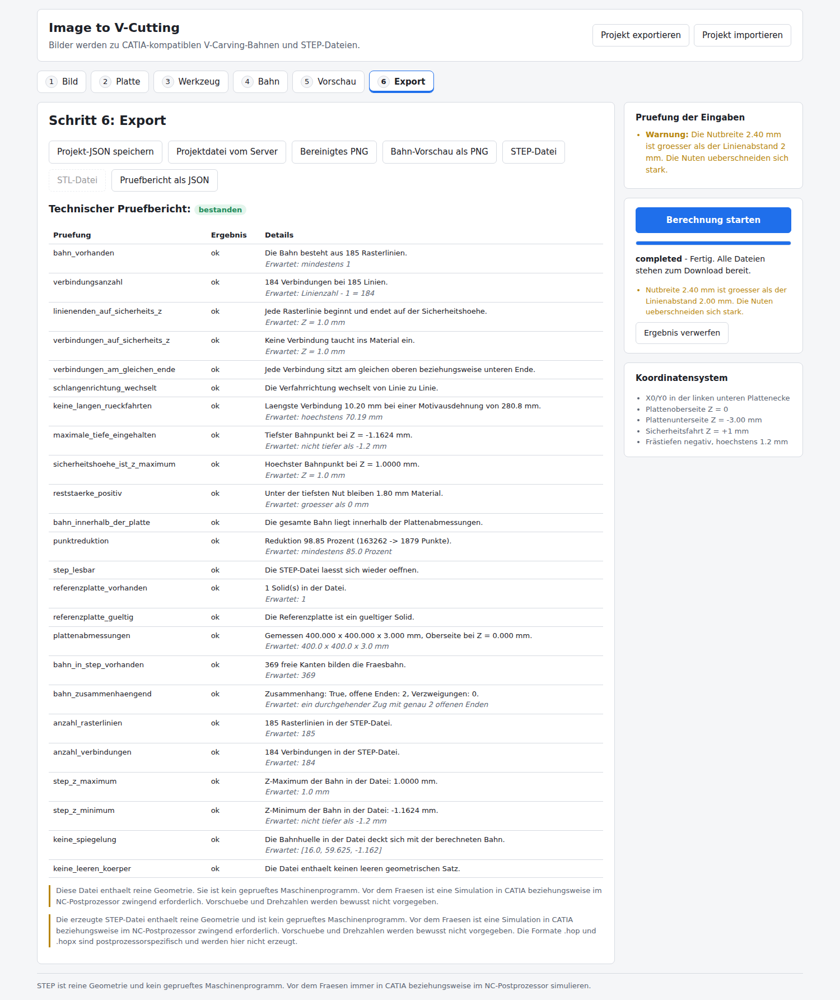
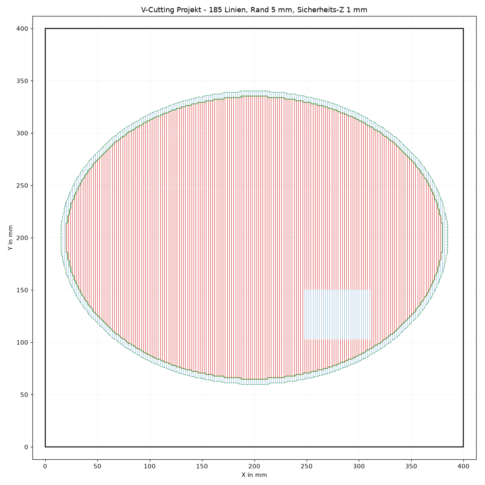

# Image to V-Cutting

Wandelt hochgeladene Bilder in CATIA-kompatible V-Carving-Bahnen um und exportiert sie als STEP-Datei. Ein 3D-Relief-Modus mit STL-Ausgabe ist ebenfalls enthalten.

> **Wichtig:** Die erzeugte STEP-Datei enthält reine Geometrie. Sie ist **kein geprüftes Maschinenprogramm**. Vor dem Fräsen ist eine Simulation in CATIA beziehungsweise im NC-Postprozessor zwingend erforderlich. Vorschübe und Drehzahlen werden bewusst nicht vorgegeben.

---

## Inhalt

- [Zweck](#zweck)
- [Screenshots](#screenshots)
- [Voraussetzungen](#voraussetzungen)
- [Lokaler Start](#lokaler-start)
- [Start mit Docker](#start-mit-docker)
- [Bedienung](#bedienung)
- [V-Cutting-Prinzip](#v-cutting-prinzip)
- [Koordinatensystem](#koordinatensystem)
- [JSON-Projektdateien](#json-projektdateien)
- [STEP-Import in CATIA](#step-import-in-catia)
- [Relief-Modus](#relief-modus)
- [Tests und Qualität](#tests-und-qualität)
- [Bekannte Einschränkungen](#bekannte-einschränkungen)
- [Sicherheitshinweise](#sicherheitshinweise)

---

## Zweck

Ein Bild wird zu einer Fräsbahn: dunkle Bildstellen werden tief gefräst, helle Stellen bleiben stehen. Die Bahn folgt dabei **nur der Motivkontur plus einem einstellbaren Rand**, nicht dem rechteckigen Bildhintergrund. Das spart Fräszeit und vermeidet unnötige Bahnen über leere Plattenbereiche.

Das Ergebnis ist eine STEP-Datei mit

- einem massiven Referenzkörper für die Platte (auswählbare Flächen, Kanten, Eckpunkte),
- einem zusammenhängenden Drahtkörper für die vollständige Fräsbahn,
- beidem getrennt auswählbar in einer Datei.

Zusätzlich entstehen eine bereinigte PNG-Vorschau, eine Bahn-Vorschau, ein simuliertes Fräsbild, die versionierte Projektdatei und ein technischer Prüfbericht.

## Screenshots

| Schritt | Bild |
| --- | --- |
| Werkzeug: Nutbreite und Reststärke rechnen live mit |  |
| Vorschau: Original, bereinigtes Motiv, Fräsbahn, simuliertes Fräsbild und Kennzahlen |  |
| Export: Downloads und technischer Prüfbericht |  |

Die Bahn-Vorschau im Detail — rot fräst, blau fährt auf Sicherheits-Z, grün ist die Motivkontur samt Rand, schwarz der Plattenumriss:



Alle Bilder entstanden aus einem programmatisch erzeugten Testmotiv. Es sind keine fremden Beispielbilder im Repository.

## Voraussetzungen

**Für Docker:** Docker und Docker Compose. Sonst nichts.

**Für den lokalen Start:**

| Komponente | Version |
| --- | --- |
| Python | 3.11 |
| Node.js | 20 oder neuer (getestet mit 22) |

Unter Linux brauchen OpenCascade und OpenCV einige Systembibliotheken:

```bash
sudo apt-get install -y libgl1 libglu1-mesa libxrender1 libxext6 libsm6 libgomp1
```

## Lokaler Start

### Backend

```bash
cd backend
python3.11 -m venv .venv
source .venv/bin/activate
pip install -r requirements-dev.txt
uvicorn app.main:app --reload --port 8000
```

Das Backend läuft auf <http://localhost:8000>, die interaktive API-Dokumentation liegt unter <http://localhost:8000/docs>.

### Frontend

```bash
cd frontend
npm install
npm run dev
```

Die Oberfläche läuft auf <http://localhost:5173>. Der Vite-Entwicklungsserver leitet `/api` an das Backend weiter, es gibt also keine CORS-Sonderfälle. Zeigt das Backend woanders hin:

```bash
VITE_BACKEND_URL=http://192.168.1.20:8000 npm run dev
```

## Start mit Docker

```bash
docker compose up --build
```

- Oberfläche: <http://localhost:8080>
- API: <http://localhost:8000/api/health>

Beide Container laufen ohne Root. Im Frontend-Container leitet nginx `/api` an das Backend weiter. Jobdaten liegen im benannten Volume `job-data` und werden nach 24 Stunden automatisch aufgeräumt (einstellbar über `VCUTTING_JOB_RETENTION_SECONDS`).

Beenden und aufräumen:

```bash
docker compose down --volumes
```

### Umgebungsvariablen des Backends

| Variable | Standard | Bedeutung |
| --- | --- | --- |
| `VCUTTING_DATA_DIR` | `backend/data` | Verzeichnis der Jobdaten |
| `VCUTTING_CORS_ORIGINS` | `http://localhost:5173,…` | Erlaubte Ursprünge, kommagetrennt |
| `VCUTTING_PX_PER_MM` | `4.0` | Auflösung des internen Arbeitsrasters |
| `VCUTTING_JOB_RETENTION_SECONDS` | `86400` | Aufbewahrungsfrist der Jobverzeichnisse |

### Bereitstellung ohne Docker

Frontend und Backend sind getrennt. Das Frontend ist eine statische Seite und läuft auf jedem Hoster; das Backend braucht Python mit OpenCascade und lässt sich nicht als Serverless-Funktion betreiben.

**Frontend auf Vercel oder Netlify:**

1. Projektstamm auf `frontend/` setzen, Build-Befehl `npm run build`, Ausgabeverzeichnis `dist`.
2. Umgebungsvariable `VITE_API_BASE_URL` auf die öffentliche Adresse des Backends setzen, zum Beispiel `https://vcutting-api.example.com/api`.
3. Im Backend `VCUTTING_CORS_ORIGINS` um die Adresse des Frontends erweitern.

Alternativ ohne CORS: eine Weiterleitung einrichten. Für Netlify in `frontend/netlify.toml`:

```toml
[[redirects]]
  from = "/api/*"
  to = "https://vcutting-api.example.com/api/:splat"
  status = 200
  force = true
```

Für Vercel in `frontend/vercel.json`:

```json
{ "rewrites": [{ "source": "/api/:path*", "destination": "https://vcutting-api.example.com/api/:path*" }] }
```

Dann bleibt `VITE_API_BASE_URL` auf dem Standardwert `/api`.

**Backend als eigener Dienst:** Das Image aus `backend/Dockerfile` läuft auf jeder Plattform, die Container mit dauerhaftem Prozess und Schreibrechten auf ein Datenverzeichnis ausführt — Fly.io, Render, Railway, Hetzner, eine eigene VM. Es ist bewusst kein Cloudanbieter fest eingebaut.

## Bedienung

**Schritt 1 – Bild.** PNG, JPG oder WebP bis 20 MB per Drag-and-drop oder Dateiauswahl. Transparenz wird als Schachbrettmuster dargestellt und dient als Motivmaske.

**Schritt 2 – Platte.** Breite, Höhe, Stärke und der Rand zwischen Motiv und Plattenkante. Standard: 400 × 400 × 3 mm mit 20 mm Rand.

**Schritt 3 – Werkzeug.** Werkzeugnummer, Name, V-Winkel und maximale Frästiefe. Standard: T246, V-Nutfräser, 90°, 1,2 mm. Nutbreite und Reststärke rechnen live mit; bei einem anderen Winkel als 90° wird die geänderte Nutbreite ausdrücklich angezeigt.

**Schritt 4 – Bahn.** Linienrichtung, Linienabstand, Sicherheitshöhe, Motivrand, Tonwertschwelle, Tiefengamma und die Vereinfachungsstufe. Hier wird auch zwischen V-Cutting und Relief umgeschaltet.

**Schritt 5 – Vorschau.** Originalbild, bereinigtes Motiv, Fräsbahn mit Motivkontur, simuliertes Fräsbild sowie Linienzahl, Punktzahlen vor und nach der Vereinfachung, Reduktion in Prozent und die geschätzte STEP-Größe.

**Schritt 6 – Export.** Projekt-JSON, bereinigtes PNG, Bahn-Vorschau, STEP, optional STL und der Prüfbericht. Ein Download ist erst anklickbar, wenn die Datei tatsächlich existiert.

## V-Cutting-Prinzip

Ein V-Fräser erzeugt eine Nut, deren Breite von der Eintauchtiefe abhängt:

```
Nutbreite = 2 × Tiefe × tan(Winkel / 2)
```

Bei 90° und 1,2 mm Tiefe sind das 2,4 mm. Tiefer heißt breiter und dunkler; flacher heißt schmaler und heller. Aus der Helligkeit des Bildes entsteht so ein Graustufeneindruck.

Die Zuordnung lautet:

```
Dunkelheit  = 1 − Grauwert            (außerhalb der Motivmaske 0)
Frästiefe   = −max_depth × Dunkelheit^gamma
```

Tonwerte unterhalb der Schwelle (Standard 0,055) bleiben ungeschnitten; dort fährt das Werkzeug auf Sicherheitshöhe. Die maximale Frästiefe wird nie überschritten.

**Achtung beim Linienabstand:** Ist die Nutbreite größer als der Linienabstand, überschneiden sich die Nuten stark. Bei den Standardwerten (2,4 mm Nutbreite, 2 mm Abstand) ist das der Fall — die Oberfläche warnt entsprechend. Für getrennte Nuten den Abstand erhöhen oder die Tiefe verringern.

## Koordinatensystem

```
        Z
        │  +1 mm  Sicherheitshöhe (Leerfahrten, Linienenden)
        │   0 mm  Plattenoberseite
        │  −1,2   tiefste Nut
        │  −3 mm  Plattenunterseite
        │
  Y ────┼──── X
     (0,0) = linke untere Plattenecke
```

- X0/Y0 liegt in der **linken unteren Ecke** der Platte.
- Die **Plattenoberseite** ist Z = 0, die Unterseite liegt bei −Plattenstärke.
- **Frästiefen sind negativ**, Sicherheitsfahrten positiv.
- Das Motiv wird **weder gespiegelt noch gedreht**. Die oberste Bildzeile landet am oberen Plattenrand.

## JSON-Projektdateien

Das Projektformat ist versioniert und an drei Stellen deckungsgleich gepflegt:

| Ort | Zweck |
| --- | --- |
| `shared/schemas/vcutting-project-1.0.schema.json` | normative Beschreibung |
| `backend/app/models/config.py` | serverseitige Durchsetzung (Pydantic) |
| `frontend/src/types/project.ts` | Typen der Oberfläche |

Beispiel:

```json
{
  "schema_version": "1.0",
  "mode": "v_cutting",
  "project": { "name": "Oskar V-Cutting" },
  "plate": { "width_mm": 400, "height_mm": 400, "thickness_mm": 3, "top_z_mm": 0, "margin_mm": 20 },
  "tool": { "id": "T246", "name": "V-Nutfraeser", "type": "v_bit", "angle_deg": 90 },
  "carving": {
    "max_depth_mm": 1.2,
    "line_spacing_mm": 2,
    "orientation": "vertical",
    "path_mode": "serpentine",
    "clearance_z_mm": 1,
    "motif_margin_mm": 5,
    "tone_threshold": 0.055,
    "depth_gamma": 1.0
  },
  "simplification": { "mode": "catia_strong" },
  "output": { "include_reference_plate": true, "step": true, "stl": false, "preview_png": true }
}
```

Fehlende Felder werden aus den Standardwerten ergänzt, fehlende Vereinfachungswerte aus der gewählten Stufe. Unbekannte Felder werden ignoriert, unbekannte Schemaversionen klar abgelehnt. Die Migration künftiger Versionen hat mit `migrate_project_dict` beziehungsweise `migrateProject` einen festen Einstiegspunkt.

Import und Export laufen über die Kopfzeile der Oberfläche. Beim Import validiert zusätzlich das Backend über `POST /api/config/validate`.

## STEP-Import in CATIA

Kurzfassung — Einzelheiten in [docs/catia.md](docs/catia.md):

1. STEP-Datei über *Datei → Öffnen* laden. Millimeter sind die Einheit.
2. Der Quader ist die Referenzplatte, der Linienzug die Fräsbahn. Beide sind getrennt auswählbar.
3. Plattenflächen, -kanten und -eckpunkte lassen sich für Bezugselemente verwenden.
4. Der Drahtkörper dient als Führungselement für eine Bahnoperation.

Die Bahn besteht **nicht** aus einer einzigen riesigen B-Spline, sondern aus je einer Kurve vom Grad 1 pro Rasterlinie plus kurzen geraden Verbindungen. Genau das verhindert, dass ältere STEP-Übersetzer einen leeren geometrischen Satz erzeugen.

## Relief-Modus

Im Modus `relief` entsteht statt einer Fräsbahn ein geschlossenes, wasserdichtes STL aus dem bereinigten Graustufenbild: helle Stellen liegen hoch, der Hintergrund liegt auf der Grundfläche. Die Reliefoberfläche endet bündig mit der Plattenoberseite, das Material liegt darunter. Basisstärke plus Reliefhöhe dürfen die Plattenstärke nicht überschreiten — das wird erzwungen.

Nach dem Export wird das STL erneut eingelesen und auf Wasserdichtheit, konsistente Normalen und Maße geprüft.

## Tests und Qualität

```bash
# Backend
cd backend && ruff check . && pytest -q      # 136 Tests

# Frontend
cd frontend && npm run lint && npm run typecheck && npm run test && npm run build   # 77 Tests
```

Die GitHub-Actions-Pipeline (`.github/workflows/ci.yml`) fährt dieselben Schritte plus Docker-Build und einen Startversuch von `docker compose`.

Geprüft werden unter anderem: Nutbreite bei 90°, Reststärke, Einhaltung der maximalen Tiefe, Ausschluss transparenter Hintergründe, Entfernen kleiner Pixelinseln, fehlende Spiegelung, Motiv innerhalb der Platte, Umrechnung des 5-mm-Konturabstands, Richtungswechsel der Schlangenbahn, Verbindungen auf Sicherheits-Z, keine langen diagonalen Rückfahrten, Punktreduktion durch RDP, erneutes Öffnen der STEP-Datei, Gültigkeit der Referenzplatte sowie Ablehnung ungültiger Eingaben und beschädigter Uploads.

## Bekannte Einschränkungen

- **Keine .hop- oder .hopx-Dateien.** Diese Formate sind NC-Hops- und postprozessorspezifisch. Ohne Referenzformat wird hier nichts vorgetäuscht.
- **Kein Postprozessor.** Es entstehen keine Vorschübe, Drehzahlen, Werkzeugwechsel oder NC-Sätze.
- **Relief nicht als STEP.** Ein fein trianguliertes Relief wird bewusst nicht als facettiertes STEP exportiert; der Speicherbedarf im STEP-Übersetzer wäre unverhältnismäßig hoch. Für Relief gilt STL, für V-Cutting STEP.
- **Reliefgitter begrenzt.** Sehr feine Rasterabstände werden automatisch vergröbert, damit die STL-Datei handhabbar bleibt (rund 390 × 390 Punkte). Die Oberfläche meldet das.
- **Eine Motivkomponente.** Standardmäßig bleibt nur die größte zusammenhängende Komponente erhalten. Für mehrteilige Motive `cleanup.keep_largest_component` auf `false` setzen.
- **Nur Schlangenbahn.** Andere Bahnarten sind im MVP nicht umgesetzt.
- **Keine aggressive Freistellung.** Bilder ohne Alphakanal werden über eine einstellbare Helligkeitsschwelle freigestellt. Eine KI-Hintergrundentfernung ist bewusst nicht enthalten.
- **Jobs im Prozess.** Die Verarbeitung läuft über FastAPI-BackgroundTasks in einem einzelnen Prozess. Für mehrere gleichzeitige Nutzer wäre eine echte Warteschlange nötig.
- **Keine Anmeldung.** Wer die Job-ID kennt, kann die Dateien laden. Für den Betrieb im offenen Netz gehört ein Zugriffsschutz davor.

## Sicherheitshinweise

- Die erzeugte Datei ist **ohne Prüfung nicht maschinensicher**. Vor dem Fräsen immer eine CATIA- beziehungsweise NC-Hops-Simulation fahren.
- STEP ist Geometrie, kein geprüfter Maschinen-Postprozessor.
- Uploads werden nach ihrem tatsächlichen Inhalt geprüft, nicht nach dem gemeldeten MIME-Type. Größe und Pixelabmessungen sind begrenzt (20 MB, 40 Megapixel, 12000 Pixel je Kante), Dekompressionsbomben werden abgewiesen.
- Job-IDs müssen gültige UUIDs sein; Pfadmanipulation ist damit ausgeschlossen. Interne Dateipfade verlassen den Server nicht, alle Downloads laufen über kontrollierte Endpunkte.

---

## Weitere Dokumentation

- [ARCHITECTURE.md](ARCHITECTURE.md) — Komponenten, Datenfluss, Jobverarbeitung
- [docs/algorithm.md](docs/algorithm.md) — Tonwert zu Tiefe, Motivkontur, Schlangenbahn, Vereinfachung, STEP-Struktur
- [docs/catia.md](docs/catia.md) — STEP in CATIA öffnen und verwenden
